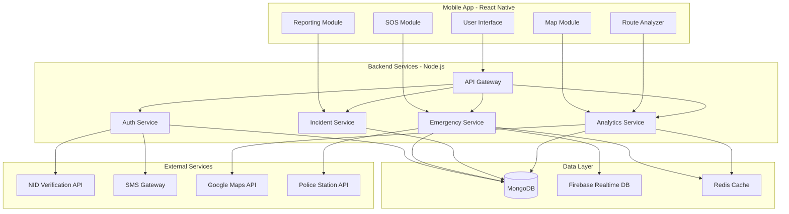
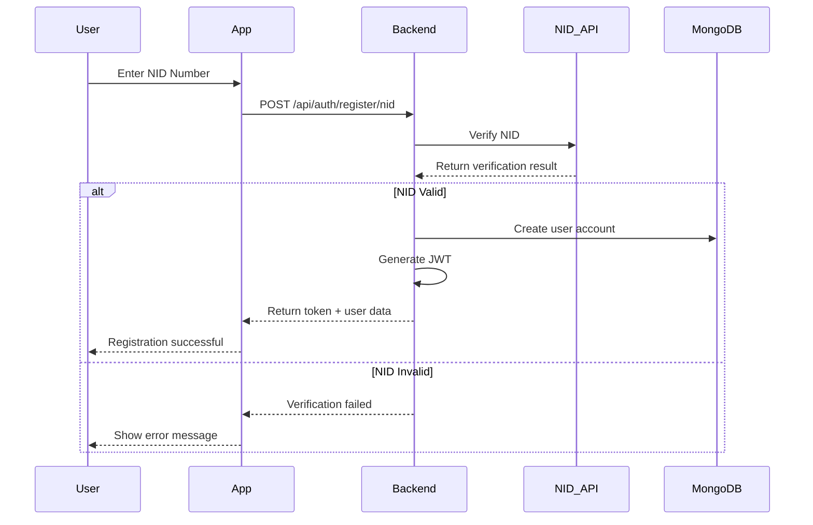
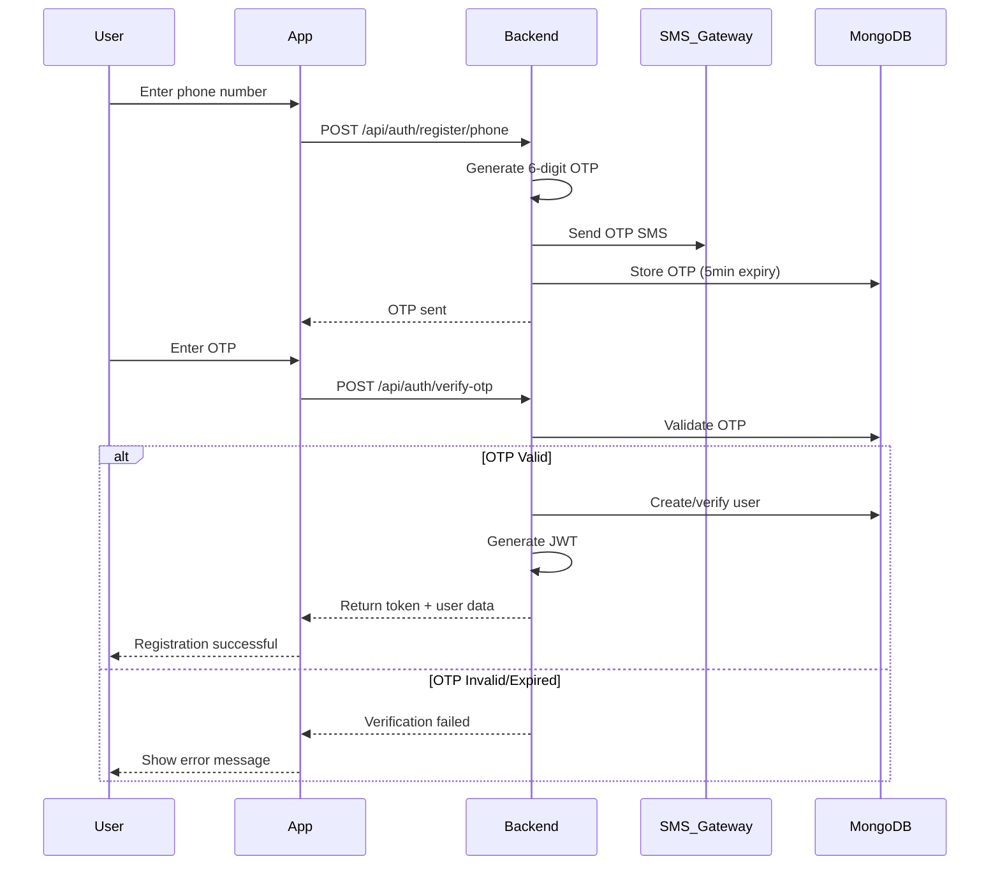
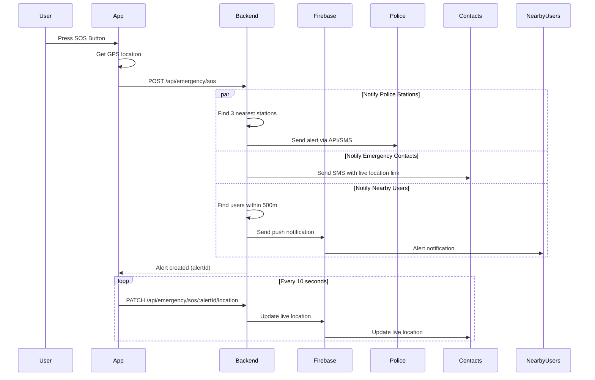
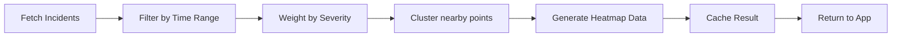
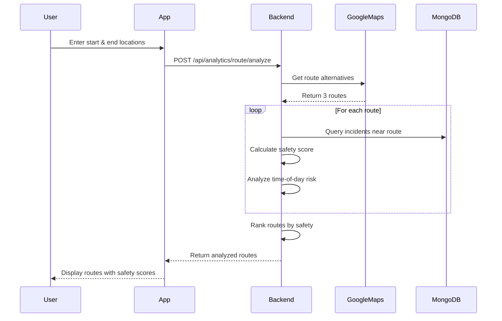

# NIRAPOTTA (নিরাপত্তা) - Technical Architecture Plan

A comprehensive mobile application for enhancing personal safety through real-time emergency response, community-driven incident reporting, and intelligent crime analytics.

## User Review Required

> [!IMPORTANT]
> **Technology Stack Decisions**
> - **Mobile**: React Native + Expo (Fast development, cross-platform)
> - **Backend**: Node.js + Express.js
> - **AI/ML**: face-api.js for real-time person identification in SOS videos
> - **Database**: MongoDB Atlas (Geospatial indexing support)
> - **Real-time**: Firebase Cloud Messaging & Socket.io for live updates
> - **Auth**: JWT + Multi-channel OTP (Phone/Email)

> [!WARNING]
> **NID Verification Requirements**
> - This feature requires integration with your national identity verification API/service
> - You'll need to provide:
>   - API endpoint for NID verification
>   - Authentication credentials
>   - Data privacy compliance documents
> - If unavailable, we'll implement phone OTP as the primary verification method

> [!IMPORTANT]
> **Police Station Integration**
> - Requires police department API access or database integration
> - Need official approval and partnership with law enforcement
> - Alternative: Manual police station database with coordinates

## Proposed Architecture

### System Overview



---

### Technology Stack Details

#### **Frontend (Mobile App)**

| Component | Technology | Purpose |
|-----------|-----------|---------|
| Framework | React Native 0.73+ | Cross-platform mobile development |
| Navigation | React Navigation 6 | Screen navigation and routing |
| State Management | Redux Toolkit + RTK Query | Global state and API caching |
| Maps | react-native-maps | Map visualization and geolocation |
| Real-time | Firebase SDK | Push notifications and live updates |
| Gestures | react-native-gesture-handler | Panic gesture detection |
| Storage | AsyncStorage + SQLite | Offline data persistence |
| Security | react-native-keychain | Secure credential storage |

#### **Backend Services**

| Component | Technology | Purpose |
|-----------|-----------|---------|
| Runtime | Node.js 20 LTS | Server-side JavaScript runtime |
| Framework | Express.js 4.18+ | REST API framework |
| Database | MongoDB 7.0+ | Primary data store with geospatial indexing |
| ODM | Mongoose 8.0+ | MongoDB object modeling |
| Real-time | Firebase Admin SDK | Server-side push notifications |
| Caching | Redis 7.0+ | Session storage and API caching |
| Auth | JWT + Firebase Auth | Token-based authentication |
| Validation | Joi / Zod | Request validation |
| Security | Helmet, CORS, rate-limit | Security middleware |
| File Upload | Multer | Media file handling for evidence |

---

### Database Schema Design

#### **Users Collection**
```javascript
{
  _id: ObjectId,
  userId: "USR_550e8400e29b41d4a716", // Generated ID
  
  // Authentication
  authMethod: "nid" | "phone",
  nidNumber: String, // Encrypted
  phoneNumber: String,
  countryCode: String,
  isVerified: Boolean,
  
  // Profile
  fullName: String,
  email: String,
  profilePhoto: String,
  
  // Security
  appSecurity: {
    enabled: Boolean,
    type: "pin" | "password" | "otp",
    hashedSecret: String
  },
  
  // Emergency Contacts
  emergencyContacts: [{
    name: String,
    phone: String,
    relationship: String
  }],
  
  // Location (for nearby alerts)
  lastKnownLocation: {
    type: "Point",
    coordinates: [longitude, latitude]
  },
  
  // Settings
  settings: {
    receiveNearbyAlerts: Boolean,
    alertRadius: Number, // in meters
    shareLocationWithContacts: Boolean
  },
  
  createdAt: Date,
  updatedAt: Date
}
```

**Indexes:**
- `{ nidNumber: 1 }` - unique, sparse
- `{ phoneNumber: 1 }` - unique, sparse
- `{ lastKnownLocation: "2dsphere" }` - geospatial queries
- `{ userId: 1 }` - unique

---

#### **SOS Alerts Collection**
```javascript
{
  _id: ObjectId,
  alertId: "SOS_550e8400e29b41d4a716",
  
  // User Info
  userId: ObjectId, // Reference to Users
  userName: String,
  userPhone: String,
  
  // Location
  location: {
    type: "Point",
    coordinates: [longitude, latitude]
  },
  address: String,
  
  // Alert Details
  timestamp: Date,
  status: "active" | "responded" | "resolved" | "cancelled",
  triggerMethod: "button" | "gesture",
  
  // Notifications Sent
  notifiedPoliceStations: [{
    stationId: ObjectId,
    stationName: String,
    distance: Number,
    notifiedAt: Date
  }],
  
  notifiedContacts: [{
    contactPhone: String,
    notifiedAt: Date,
    deliveryStatus: String
  }],
  
  notifiedNearbyUsers: [{
    userId: ObjectId,
    distance: Number,
    notifiedAt: Date
  }],
  
  // Live Tracking
  locationUpdates: [{
    coordinates: [longitude, latitude],
    timestamp: Date,
    accuracy: Number
  }],
  
  // Response
  respondedBy: String, // Police officer ID or username
  respondedAt: Date,
  responseNotes: String,
  
  resolvedAt: Date,
  createdAt: Date,
  updatedAt: Date
}
```

**Indexes:**
- `{ location: "2dsphere" }` - find nearby alerts
- `{ userId: 1, createdAt: -1 }` - user's alert history
- `{ status: 1, createdAt: -1 }` - active alerts
- `{ alertId: 1 }` - unique

---

#### **Incidents Collection**
```javascript
{
  _id: ObjectId,
  incidentId: "INC_550e8400e29b41d4a716",
  
  // Reporter
  reportedBy: ObjectId, // Reference to Users
  isAnonymous: Boolean,
  
  // Location
  location: {
    type: "Point",
    coordinates: [longitude, latitude]
  },
  address: String,
  landmark: String,
  
  // Incident Details
  type: "robbery" | "harassment" | "assault" | "suspicious_activity" | "hazard" | "other",
  severity: "low" | "medium" | "high" | "critical",
  title: String,
  description: String,
  
  // Evidence
  photos: [String], // URLs
  videos: [String], // URLs
  
  // Metadata
  incidentTime: Date, // When incident occurred
  reportedAt: Date, // When reported
  
  // Verification
  verificationStatus: "pending" | "verified" | "disputed" | "spam",
  verifiedBy: ObjectId, // Admin/Police user ID
  verificationNotes: String,
  
  // Engagement
  upvotes: Number,
  downvotes: Number,
  viewCount: Number,
  
  // Status
  status: "open" | "investigating" | "resolved" | "closed",
  
  createdAt: Date,
  updatedAt: Date
}
```

**Indexes:**
- `{ location: "2dsphere" }` - geospatial queries for heatmap
- `{ reportedBy: 1, createdAt: -1 }` - user's reports
- `{ type: 1, createdAt: -1 }` - filter by incident type
- `{ verificationStatus: 1 }` - pending verifications
- `{ incidentId: 1 }` - unique

---

#### **Police Stations Collection**
```javascript
{
  _id: ObjectId,
  stationId: "PS_550e8400e29b41d4a716",
  
  name: String,
  location: {
    type: "Point",
    coordinates: [longitude, latitude]
  },
  address: String,
  
  // Contact
  phone: String,
  emergencyHotline: String,
  email: String,
  
  // Coverage
  jurisdictionArea: {
    type: "Polygon",
    coordinates: [[[lng, lat], ...]] // GeoJSON polygon
  },
  
  // Integration
  apiEndpoint: String, // If they have API integration
  acceptsDigitalAlerts: Boolean,
  
  isActive: Boolean,
  createdAt: Date,
  updatedAt: Date
}
```

**Indexes:**
- `{ location: "2dsphere" }` - find nearest stations
- `{ stationId: 1 }` - unique

---

#### **Routes Analysis Collection**
```javascript
{
  _id: ObjectId,
  routeId: "RTE_550e8400e29b41d4a716",
  
  // Route Details
  startLocation: {
    type: "Point",
    coordinates: [longitude, latitude]
  },
  endLocation: {
    type: "Point",
    coordinates: [longitude, latitude]
  },
  
  // Path (from Google Maps)
  polyline: String, // Encoded polyline
  distance: Number, // meters
  duration: Number, // seconds
  
  // Safety Analysis
  safetyScore: Number, // 0-100
  riskLevel: "safe" | "moderate" | "risky" | "dangerous",
  
  // Crime Statistics along route
  incidentsNearby: [{
    incidentId: ObjectId,
    type: String,
    distance: Number, // meters from route
    timestamp: Date
  }],
  
  totalIncidents: Number,
  criticalIncidents: Number,
  
  // Time-based risk
  analyzedForTime: Date,
  timeOfDayRisk: String, // "low" | "medium" | "high"
  
  // Recommendation
  isRecommended: Boolean,
  alternativeSuggested: Boolean,
  
  requestedBy: ObjectId,
  createdAt: Date
}
```

**Indexes:**
- `{ requestedBy: 1, createdAt: -1 }` - user's route history
- `{ startLocation: "2dsphere" }` - geospatial queries

---

### API Endpoints

#### **Authentication Service**

| Method | Endpoint | Description |
|--------|----------|-------------|
| POST | `/api/auth/register/nid` | Register with NID verification |
| POST | `/api/auth/register/phone` | Register with phone + OTP |
| POST | `/api/auth/verify-otp` | Verify OTP code |
| POST | `/api/auth/login` | Login user |
| POST | `/api/auth/refresh-token` | Refresh JWT token |
| POST | `/api/auth/app-security/setup` | Setup app-level PIN/password |
| POST | `/api/auth/app-security/verify` | Verify app-level security |
| GET | `/api/auth/me` | Get current user profile |

#### **Emergency Service**

| Method | Endpoint | Description |
|--------|----------|-------------|
| POST | `/api/emergency/sos` | Trigger SOS alert |
| PATCH | `/api/emergency/sos/:alertId/location` | Update live location |
| PATCH | `/api/emergency/sos/:alertId/cancel` | Cancel SOS alert |
| GET | `/api/emergency/sos/:alertId` | Get SOS alert details |
| GET | `/api/emergency/nearby-alerts` | Get nearby active SOS alerts |
| POST | `/api/emergency/contacts` | Add emergency contact |
| PUT | `/api/emergency/contacts/:contactId` | Update emergency contact |
| DELETE | `/api/emergency/contacts/:contactId` | Remove emergency contact |

#### **Incident Reporting Service**

| Method | Endpoint | Description |
|--------|----------|-------------|
| POST | `/api/incidents` | Report new incident |
| POST | `/api/incidents/:id/media` | Upload evidence files |
| GET | `/api/incidents` | Get incidents (with filters) |
| GET | `/api/incidents/:id` | Get incident details |
| GET | `/api/incidents/nearby` | Get incidents near location |
| PATCH | `/api/incidents/:id/vote` | Upvote/downvote incident |
| DELETE | `/api/incidents/:id` | Delete own incident report |

#### **Analytics Service**

| Method | Endpoint | Description |
|--------|----------|-------------|
| GET | `/api/analytics/heatmap` | Get crime heatmap data |
| POST | `/api/analytics/route/analyze` | Analyze route safety |
| GET | `/api/analytics/stats` | Get crime statistics by area |
| GET | `/api/analytics/trends` | Get crime trends over time |

#### **User Service**

| Method | Endpoint | Description |
|--------|----------|-------------|
| GET | `/api/users/profile` | Get user profile |
| PUT | `/api/users/profile` | Update user profile |
| PUT | `/api/users/settings` | Update user settings |
| GET | `/api/users/my-reports` | Get user's incident reports |
| GET | `/api/users/my-alerts` | Get user's SOS alert history |

---

### Mobile App Structure

```
safety-app/
├── android/                     # Android native code
├── ios/                         # iOS native code
├── src/
│   ├── api/                     # API client configuration
│   │   ├── axios-config.ts
│   │   ├── auth.api.ts
│   │   ├── emergency.api.ts
│   │   ├── incidents.api.ts
│   │   └── analytics.api.ts
│   │
│   ├── components/              # Reusable components
│   │   ├── common/
│   │   │   ├── Button.tsx
│   │   │   ├── Input.tsx
│   │   │   ├── Card.tsx
│   │   │   └── Loading.tsx
│   │   ├── SOS/
│   │   │   ├── SOSButton.tsx
│   │   │   ├── PanicGestureDetector.tsx
│   │   │   └── AlertDialog.tsx
│   │   ├── Map/
│   │   │   ├── HeatmapLayer.tsx
│   │   │   ├── IncidentMarker.tsx
│   │   │   ├── RouteOverlay.tsx
│   │   │   └── UserLocationMarker.tsx
│   │   └── Incidents/
│   │       ├── IncidentCard.tsx
│   │       ├── IncidentForm.tsx
│   │       └── MediaUploader.tsx
│   │
│   ├── screens/                 # App screens
│   │   ├── Auth/
│   │   │   ├── WelcomeScreen.tsx
│   │   │   ├── RegisterScreen.tsx
│   │   │   ├── NIDVerificationScreen.tsx
│   │   │   ├── PhoneVerificationScreen.tsx
│   │   │   ├── OTPScreen.tsx
│   │   │   └── AppSecuritySetupScreen.tsx
│   │   ├── Home/
│   │   │   ├── HomeScreen.tsx
│   │   │   └── MapViewScreen.tsx
│   │   ├── Emergency/
│   │   │   ├── SOSScreen.tsx
│   │   │   ├── ActiveAlertScreen.tsx
│   │   │   └── EmergencyContactsScreen.tsx
│   │   ├── Incidents/
│   │   │   ├── ReportIncidentScreen.tsx
│   │   │   ├── IncidentListScreen.tsx
│   │   │   ├── IncidentDetailsScreen.tsx
│   │   │   └── MyReportsScreen.tsx
│   │   ├── Routes/
│   │   │   ├── RouteCheckerScreen.tsx
│   │   │   └── RouteResultScreen.tsx
│   │   └── Profile/
│   │       ├── ProfileScreen.tsx
│   │       └── SettingsScreen.tsx
│   │
│   ├── navigation/              # Navigation configuration
│   │   ├── AppNavigator.tsx
│   │   ├── AuthNavigator.tsx
│   │   └── MainNavigator.tsx
│   │
│   ├── store/                   # Redux store
│   │   ├── index.ts
│   │   ├── slices/
│   │   │   ├── authSlice.ts
│   │   │   ├── emergencySlice.ts
│   │   │   ├── incidentsSlice.ts
│   │   │   └── settingsSlice.ts
│   │   └── api/
│   │       └── apiSlice.ts      # RTK Query
│   │
│   ├── services/                # Business logic & utilities
│   │   ├── location.service.ts
│   │   ├── notification.service.ts
│   │   ├── gesture.service.ts
│   │   ├── storage.service.ts
│   │   └── analytics.service.ts
│   │
│   ├── hooks/                   # Custom React hooks
│   │   ├── useLocation.ts
│   │   ├── useGeofencing.ts
│   │   ├── usePanicGesture.ts
│   │   └── useOfflineSync.ts
│   │
│   ├── utils/                   # Helper functions
│   │   ├── validators.ts
│   │   ├── formatters.ts
│   │   └── constants.ts
│   │
│   └── types/                   # TypeScript definitions
│       ├── user.types.ts
│       ├── incident.types.ts
│       └── emergency.types.ts
│
└── package.json
```

---

### Backend Structure

```
safety-backend/
├── src/
│   ├── config/                  # Configuration files
│   │   ├── database.js
│   │   ├── firebase.js
│   │   ├── redis.js
│   │   └── env.js
│   │
│   ├── models/                  # Mongoose models
│   │   ├── User.js
│   │   ├── SOSAlert.js
│   │   ├── Incident.js
│   │   ├── PoliceStation.js
│   │   └── RouteAnalysis.js
│   │
│   ├── routes/                  # API routes
│   │   ├── auth.routes.js
│   │   ├── emergency.routes.js
│   │   ├── incidents.routes.js
│   │   ├── analytics.routes.js
│   │   └── users.routes.js
│   │
│   ├── controllers/             # Request handlers
│   │   ├── auth.controller.js
│   │   ├── emergency.controller.js
│   │   ├── incidents.controller.js
│   │   ├── analytics.controller.js
│   │   └── users.controller.js
│   │
│   ├── services/                # Business logic
│   │   ├── auth.service.js
│   │   ├── nid-verification.service.js
│   │   ├── sms.service.js
│   │   ├── emergency.service.js
│   │   ├── notification.service.js
│   │   ├── geospatial.service.js
│   │   ├── heatmap.service.js
│   │   └── route-analyzer.service.js
│   │
│   ├── middleware/              # Express middleware
│   │   ├── auth.middleware.js
│   │   ├── validation.middleware.js
│   │   ├── error.middleware.js
│   │   └── rate-limit.middleware.js
│   │
│   ├── utils/                   # Utilities
│   │   ├── id-generator.js
│   │   ├── encryption.js
│   │   ├── logger.js
│   │   └── helpers.js
│   │
│   ├── validators/              # Request validation schemas
│   │   ├── auth.validator.js
│   │   ├── emergency.validator.js
│   │   └── incidents.validator.js
│   │
│   └── app.js                   # Express app setup
│
├── server.js                    # Entry point
├── package.json
└── .env.example
```

---

## Key Features Implementation

### A. User Registration & Verification

#### **NID Verification Flow**



**Implementation Details:**
- Encrypt NID before storing in database
- Rate limit verification attempts (3 per minute)
- Cache successful verifications for 24 hours
- Implement retry logic with exponential backoff

#### **Phone OTP Verification Flow**



**Implementation Details:**
- OTP expires after 5 minutes
- Maximum 3 OTP requests per phone per hour
- Maximum 5 verification attempts per OTP
- Use Firebase Authentication + custom claims for JWT

---

### B. SOS & Emergency Services

#### **SOS Button Activation**



**Implementation Details:**

**SOS Button Component:**
```typescript
// Long press for 2 seconds to prevent accidental triggers
<SOSButton
  onLongPress={() => triggerSOS()}
  delayLongPress={2000}
  hapticFeedback={true}
  countdown={true}
/>
```

**Panic Gesture Detection:**
```typescript
// Shake detection: 3 rapid shakes within 1 second
const SHAKE_THRESHOLD = 15; // m/s²
const SHAKE_COUNT = 3;
const SHAKE_WINDOW = 1000; // ms

useAccelerometer((data) => {
  const acceleration = Math.sqrt(
    data.x ** 2 + data.y ** 2 + data.z ** 2
  );
  
  if (acceleration > SHAKE_THRESHOLD) {
    registerShake();
    if (shakeCount >= SHAKE_COUNT) {
      triggerSOS();
    }
  }
});
```

**Finding Nearest Police Stations:**
```javascript
// MongoDB geospatial query
const nearestStations = await PoliceStation.find({
  location: {
    $near: {
      $geometry: {
        type: 'Point',
        coordinates: [longitude, latitude]
      },
      $maxDistance: 10000 // 10km radius
    }
  },
  isActive: true
}).limit(3);
```

**Live Location Broadcasting:**
- Update location every 10 seconds
- Store location trail in Firebase Realtime Database
- Share read-only link with emergency contacts
- Automatic stop after 1 hour or manual cancellation

---

### C. Crime Heatmap Generation



**Heatmap Algorithm:**

```javascript
// Aggregation pipeline for heatmap data
const heatmapData = await Incident.aggregate([
  // Filter verified incidents from last 6 months
  {
    $match: {
      verificationStatus: 'verified',
      incidentTime: {
        $gte: new Date(Date.now() - 180 * 24 * 60 * 60 * 1000)
      }
    }
  },
  
  // Weight by severity
  {
    $addFields: {
      weight: {
        $switch: {
          branches: [
            { case: { $eq: ['$severity', 'critical'] }, then: 4 },
            { case: { $eq: ['$severity', 'high'] }, then: 3 },
            { case: { $eq: ['$severity', 'medium'] }, then: 2 },
            { case: { $eq: ['$severity', 'low'] }, then: 1 }
          ],
          default: 1
        }
      }
    }
  },
  
  // Project required fields
  {
    $project: {
      latitude: { $arrayElemAt: ['$location.coordinates', 1] },
      longitude: { $arrayElemAt: ['$location.coordinates', 0] },
      weight: 1
    }
  }
]);

// Cache for 1 hour
await redis.setex(
  `heatmap:${bbox}:${timeRange}`,
  3600,
  JSON.stringify(heatmapData)
);
```

**Mobile App Rendering:**
```typescript
<MapView>
  <Heatmap
    points={heatmapData.map(point => ({
      latitude: point.latitude,
      longitude: point.longitude,
      weight: point.weight
    }))}
    opacity={0.7}
    radius={40}
    gradient={{
      colors: ['green', 'yellow', 'orange', 'red'],
      startPoints: [0.1, 0.4, 0.7, 1.0],
    }}
  />
</MapView>
```

---

### D. Safe Route Checker



**Safety Score Calculation:**

```javascript
async function calculateSafetyScore(route, timeOfTravel) {
  const routeBuffer = 200; // meters on each side
  
  // Get incidents near route polyline
  const incidents = await Incident.aggregate([
    {
      $geoNear: {
        near: route.polyline,
        distanceField: 'distance',
        maxDistance: routeBuffer,
        spherical: true,
        query: {
          verificationStatus: 'verified',
          incidentTime: {
            $gte: new Date(Date.now() - 90 * 24 * 60 * 60 * 1000) // Last 3 months
          }
        }
      }
    }
  ]);
  
  // Calculate base score
  let score = 100;
  
  // Deduct points for incidents
  incidents.forEach(incident => {
    const recencyFactor = calculateRecencyWeight(incident.incidentTime);
    const severityScore = {
      'critical': 20,
      'high': 15,
      'medium': 10,
      'low': 5
    }[incident.severity];
    
    const distanceDecay = 1 - (incident.distance / routeBuffer);
    score -= severityScore * recencyFactor * distanceDecay;
  });
  
  // Time-of-day adjustment
  const hour = new Date(timeOfTravel).getHours();
  if (hour >= 22 || hour <= 5) {
    score *= 0.85; // Night penalty
  }
  
  // Ensure score is between 0-100
  return Math.max(0, Math.min(100, score));
}

function calculateRecencyWeight(incidentTime) {
  const daysAgo = (Date.now() - incidentTime) / (1000 * 60 * 60 * 24);
  
  if (daysAgo <= 7) return 1.0;      // Last week: full weight
  if (daysAgo <= 30) return 0.7;     // Last month: 70%
  if (daysAgo <= 90) return 0.4;     // Last 3 months: 40%
  return 0.2;                         // Older: 20%
}
```

**Route Display:**
```typescript
<SafeRouteCard
  score={85}
  riskLevel="safe"       // safe | moderate | risky | dangerous
  distance="5.2 km"
  duration="15 min"
  incidentCount={3}
  recommendation="Recommended route"
  color="green"
/>
```

---

## Verification Plan

### Phase 1: Core Features Testing

#### **Authentication Testing**
```bash
# Manual testing checklist
- [ ] NID registration (if API available)
- [ ] Phone registration with OTP
- [ ] OTP expiry after 5 minutes
- [ ] Rate limiting on OTP requests
- [ ] App security (PIN/Password) setup
- [ ] Login with credentials
- [ ] Token refresh mechanism
```

#### **SOS Testing**
```bash
# Automated tests
npm run test:emergency

# Manual testing
- [ ] SOS button activation
- [ ] Panic gesture detection (shake phone 3 times)
- [ ] GPS location accuracy
- [ ] Police notification sent
- [ ] Emergency contacts SMS received
- [ ] Nearby users receive push notification
- [ ] Live location updates every 10 seconds
- [ ] SOS cancellation
```

#### **Incident Reporting**
```bash
# Manual testing
- [ ] Create incident report
- [ ] Upload photos/videos
- [ ] View incidents on map
- [ ] Filter by incident type
- [ ] Upvote/downvote reports
- [ ] Anonymous reporting
```

#### **Heatmap & Routes**
```bash
# Testing
- [ ] Heatmap displays crime density
- [ ] Color coding reflects severity
- [ ] Route safety scoring accuracy
- [ ] Alternative route suggestions
- [ ] Time-of-day risk adjustment
```

---

### Phase 2: Performance Testing

| Test Case | Tool | Target Metric |
|-----------|------|---------------|
| API Response Time | Artillery | < 200ms (p95) |
| SOS Alert Delivery | Custom script | < 3 seconds |
| Concurrent Users | k6 | 1000+ simultaneous |
| Database Query Speed | MongoDB Profiler | < 100ms |
| Map Rendering | React DevTools | 60 FPS |

---

### Phase 3: Security Testing

```bash
# Security checklist
- [ ] Encrypted data at rest (NID, passwords)
- [ ] HTTPS/TLS for all API calls
- [ ] JWT token expiry (15 min access, 7 day refresh)
- [ ] Rate limiting on all endpoints
- [ ] SQL injection prevention (Mongoose handles this)
- [ ] XSS protection (input sanitization)
- [ ] CORS properly configured
- [ ] File upload validation (type, size)
- [ ] PII data access logs
```

---

### Phase 4: Real-World Testing

#### **Field Testing Scenarios**
1. **Emergency Response Time**
   - Trigger SOS in different locations
   - Measure time from button press to notification received
   - Test in poor network conditions

2. **Geospatial Accuracy**
   - Report incidents at known locations
   - Verify heatmap accuracy
   - Test route checker with real commute paths

3. **User Acceptance Testing**
   - Beta test with 50-100 users
   - Collect feedback on UI/UX
   - Monitor crash reports and errors

---

## Development Timeline Estimate

| Phase | Duration | Deliverables |
|-------|----------|--------------|
| **Setup & Infrastructure** | 1 week | Backend deployed, DB configured, React Native initialized |
| **Authentication Module** | 1.5 weeks | User registration, OTP, app security |
| **SOS Emergency Services** | 2 weeks | SOS button, panic gesture, notifications, live tracking |
| **Incident Reporting** | 1.5 weeks | Report creation, media upload, list/detail views |
| **Crime Analytics** | 2 weeks | Heatmap generation, route analyzer, scoring algorithm |
| **Integration & Polish** | 1 week | Connect all modules, UI refinement, bug fixes |
| **Testing & QA** | 1 week | Comprehensive testing, security audit |
| **Deployment** | 3 days | Backend deployment, Android app release |
| **Total** | **~9-10 weeks** | Fully functional MVP |

---

## Next Steps

Once you approve this plan, I will:

1. ✅ **Create project structure** for both React Native app and Node.js backend
2. ✅ **Setup development environment** with necessary dependencies
3. ✅ **Begin with Phase 2** (Backend Development) starting with authentication
4. ✅ **Provide code templates** and detailed implementation guides for each module

> [!NOTE]
> This is an MVP (Minimum Viable Product) plan focusing on core safety features. Advanced AI-based crime prediction can be added in Phase 2 after collecting sufficient data (6+ months of incident reports).
